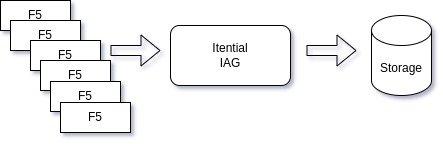

Backing up the configs of our [F5 BIG-IP](https://www.f5.com/) appliances was my first [Itential](https://www.itential.com/automation-platform/) automation.  The goal was to backup about 100 F5 BIG-IPs weekly to a file server.




```
#
# Playbook to fetch backup file from network device
#
# Steps:
# 1. Fetch file cs_backup.ucs from network device to local file
# 2. Copy local file to backup server

---
- name: F5 UCS Backup Fetch
  hosts: "{{network_device|default('all')}}"
  connection: local

  vars:
    fetch_flat: true

  tasks:
    - name: TASK - Set Facts
      set_fact:
        provider:
          server: "{{ ansible_host }}"
          user: "{{ user }}"
          password: "{{ password }}"
          validate_certs: no
        f5_host: "{{ ansible_host }}"
        src_filename: "cs_backup.ucs"
        local_filename: "/data01/ucs_backup_copy/{{ network_device }}.ucs"

    - name: TASK - Save UCS backup on Active F5
      connection: local
      bigip_ucs_fetch:
        provider: "{{ provider }}"
        src: "{{ src_filename }}"
        dest: "{{ local_filename }}"
      ignore_errors: yes
      register: result

    - name: TASK - Set Facts
      set_fact:
        remote_filename: "/tftpboot/F5-Backups/{{ network_device }}-{{ ansible_date_time.iso8601_basic_short }}.ucs"

    - name: TASK - Copy to remote
      local_action: command sshpass -p "{{ password }}" scp -o StrictHostKeyChecking=no -o UserKnownHostsFile=/dev/null -v "{{ local_filename }}" "{{ username }}"@"{{ backup_server }}":"{{ remote_filename }}"

    - name: TASK - Remove local backup file
      local_action: file path={{ local_filename }} state=absent
```

Itential loops through all of the F5 devices and runs this ansible playbook on each one.  The ansible playbook runs the bigip_ucs_fetch module on the F5, which does the actual configuration backup.  Then we take this backup file and copy it to secure storage.

Itential keeps track of successes and failures and sends an email with the results of all of the backup jobs.