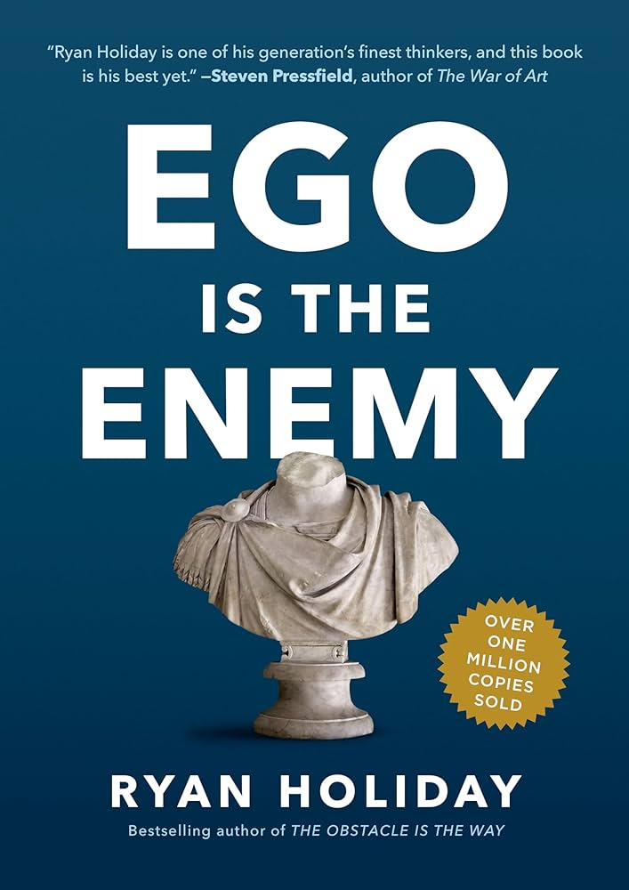

Ego is the Enemy by Ryan Holliday helped me get through getting laid off from Lumen Technologies.

It helped me realize that it's not about being something.  It's about doing something.  Focus on action.  What are some things I can control?  What are some things I can do?

I was always focused on being a network engineer, and now that I have become one, then what?  I realize that it was never about being, it should have been more about accomplishing things.  I didn't set enough goals, I let myself get swept along by the day to day tasks of the job.  I should have set aside more time to keep advancing toward big things.

Employment status doesn't matter as much as doing awesome things in life.

Ego is the enemy because it stands in the way of getting things done.  Ego wants me to take it personally, to be upset about the state of things, to be angry at whoever made the decision to lay me off.  Instead of emotions, get on with actions.

What are some actions to take?

- learn, study, write, think, go for walks.
- Let go of the things you can't control.
- Break free of your phone.  Stop doomscrolling and mindlessly checking social media and news sites.  Make technology work for you, not the other way around.

Once you figure out next steps and get rid of distractions, you'll have time to work on yourself.  Make the resume of the person you want to be, the person who companies are hiring, and then get to work on making it a reality.

For me, I let my certifications expire during my time at Lumen.  After the layoff, my path forward was getting those certifications back, and then shooting for higher goals.  I needed to remove all of the time sinks in my life that brought no value to me and replace those with studying.

Now I am in the process of getting those back, getting back on track, and using my time to become the person I was meant to be.
